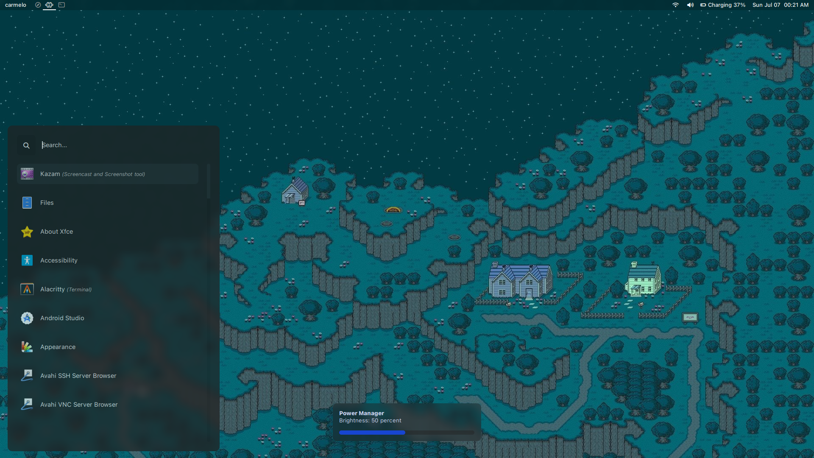
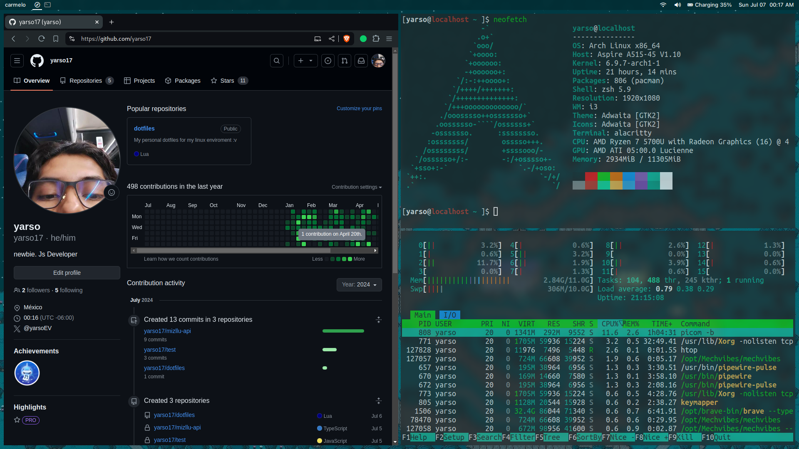
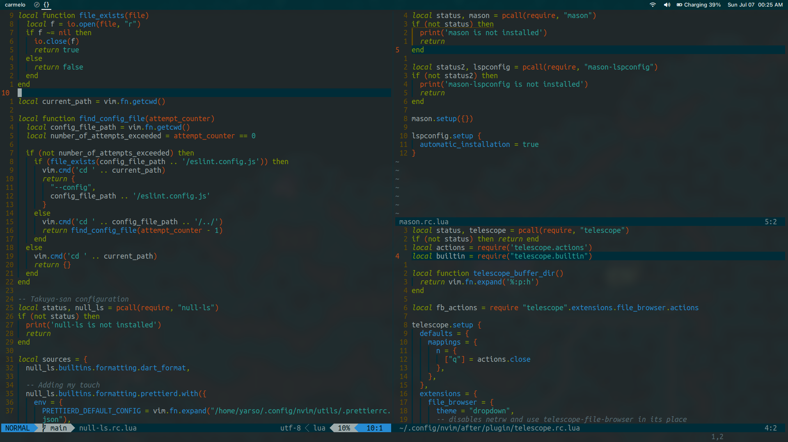

# Yarso's dotfiles

**Warning:** Don’t blindly use my settings unless you know what that entails. Use at your own risk!

## Contents

- i3 _(window manager)_
- picom _(compositor for X11) (based on [ricmurphyxyz old setup](https://github.com/ericmurphyxyz/dotfiles/blob/xorg/.config/picom/picom.conf))_
- polybar _(status bar) (based on [ghifarit53 setup](https://gist.github.com/ghifarit53/29125cd6099eaea2eb1a1311a4ea2df8))_
- dunst _(notification-daemon)_
- alacritty _(terminal emulator)_
- rofi _(dmenu replacement) (based on [adi1090x rofi repo](https://github.com/adi1090x/rofi))_
- vim _(Neovim) (text editor) (based on [takuya-san](https://github.com/craftzdog) old setup)_
