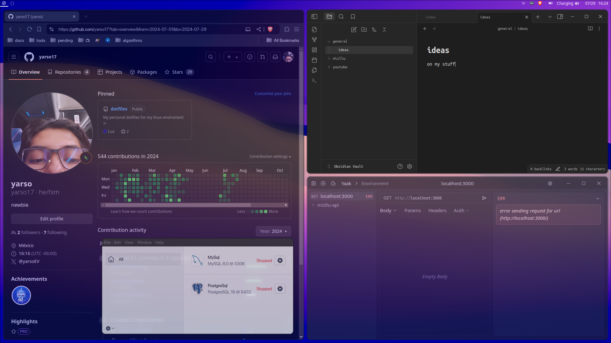

# Yarso's dotfiles

**Warning:** Don’t blindly use my settings unless you know what that entails. Use at your own risk!

## Contents

- hyprland _(window manager)_
- waybar _(status bar) (based on my old polybar configuration, take a look [here](https://github.com/yarso17/dotfiles/tree/b15e0a7b570f21eadcd10224a8fba1920c863635))_
- dunst _(notification-daemon)_
- kitty _(terminal emulator)_
- wofi _(program launcher)_
- vim _(Neovim) (text editor) (based on [takuya-san](https://github.com/craftzdog) old setup)_
- tmux _(terminal multiplexer) (using [TPM](https://github.com/tmux-plugins/tpm) as package manager for tmux)_

### nwg-look to set gtk theme

I take my gtk theme from [Vince](https://github.com/vinceliuice)
